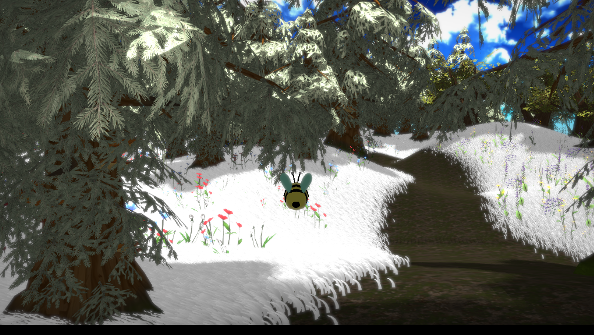
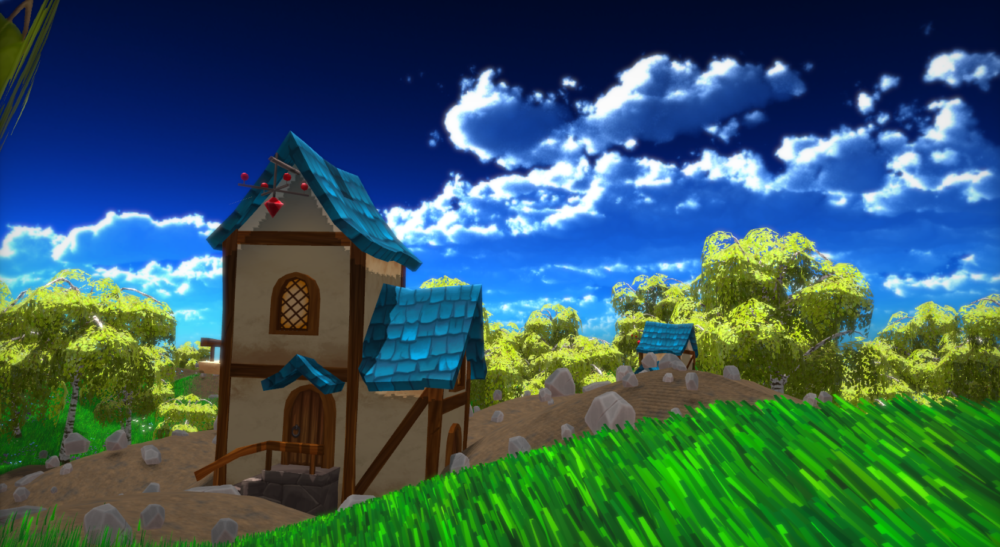
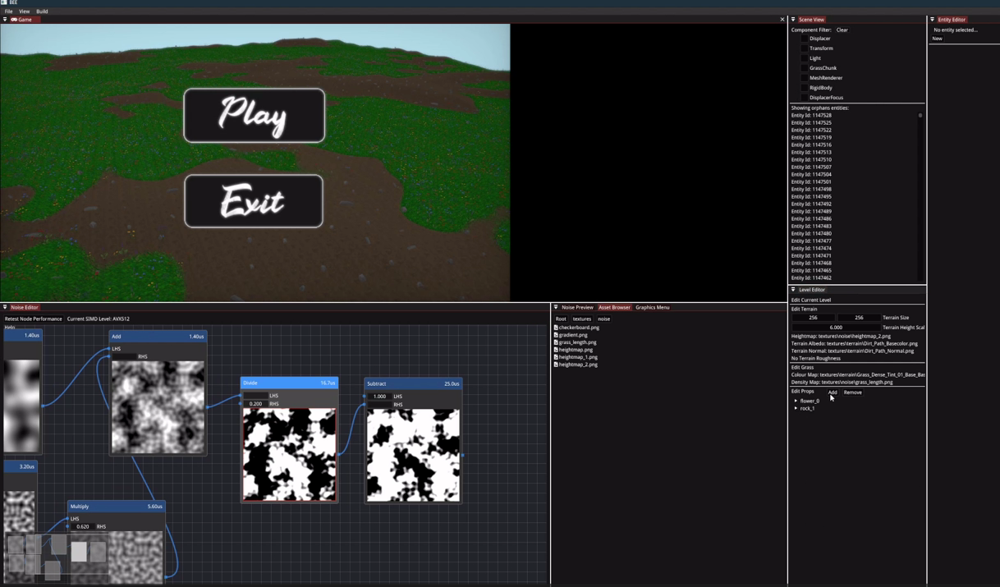

Blossom - Game Engine created during my study at BUAS in 8 weeks. Made for relaxing casual and beautiful games like [Flower](https://store.steampowered.com/app/966330/Flower/).

<video width="100%" height="100%" controls>
  <source src="../assets/videos/Blossom.mp4" type="video/mp4">
</video>

### Showcase

I, along with 4 other colleagues, have developed Blossom, a game engine that supports **PC and PS5**. The engine was made with the intention of rendering and generating **impressive natural landscapes for casual, walking-sim games**. 

In this project, **I was mainly responsible for the tooling of the engine**, which comprised **an editor for procedurally generating landscapes based on density maps** and **packaging and loading levels from a .json file**.

<video width="100%" controls>
  <source src="../assets/videos/usingEditor.mp4" type="video/mp4">
</video>

Using the editor to place some trees around, based on a density map. A density map is simply a greyscale image that dictates the probability of a prop being placed

We have also integrated the FastNoise library to aid in creating density maps and height maps for the terrain based on combinations of noise.

The Editor GUI was all accomplished using [Dear ImGui](https://github.com/ocornut/imgui).

Special thanks for all my colleagues that contributed to the project:
- [Ferri de Lange](https://ferri.dev/) - Graphics
- Alex Vreeland - Gameplay
- [Lon van Ettinger](https://www.linkedin.com/in/lon-van-ettinger/) - Graphics
- [Konstantin Kozačišče](https://www.linkedin.com/in/konstantin-kozacisce/) - Graphics