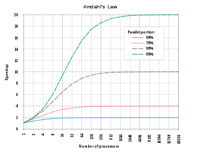
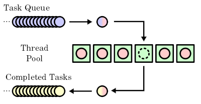

## Introduction

In most AAA game titles nowadays, we have seen a rising trend to creating bigger worlds with more content and even more detail.

Most notably, the open-world genre has become very prevalent in the gaming industry during the last 10 years and nowadays game download sizes are getting to the 100GB+ mark. This requires the management of huge amount of memory to squeeze as much performance from the hardware.

There are three main techniques game developers use to achieving what is commonly called world/level streaming:

- Multithreading 
- Partitioning/Chunking
- Levels of Detail (LODs)

World streaming is the process where we only have the necessary section of a world in memory at all times, discarding the rest. 

Normally, a radius around the player is loaded, loading new objects as they travel and unloading the ones they get far from. Multithreading is used to make the loading process happen in the background (possibly) over multiple frames and LODs are used to optimize the rendering of far away objects.

### Who am I?

My name is Santiago Bernardino. During my time at BUAS - Game Programming course, I tasked myself with implementing this concept for a self study block.

For six weeks, I researched and created a basic showcase and application of world streaming. I delved more into the topics of Multithreading and Partitioning. I did not work with LODs, mostly due to them being especially complex and time consuming.

I will also log here my main implementation steps in C++ for creating an asynchronous asset manager and using it to create a demo that utilizes world streaming to render a large and heavy scene.

Part of my project is present in the LibStream library, my own resource management library written in C++ for this very project. Then, I used the Bee Engine for developing the demo, which is an in-house small engine for students, that utilizes the entt library and OpenGL as a rendering backend.

## Multithreading - The Good, the Bad and the Ugly

### What is multi-threading?

Most modern machines nowadays possess more than one core. A core is a vital part of a computer that is capable of executing a set of instructions, one at a time, REALLY fast. With more than one core, a computer can execute instructions in parallel, independent of each other.

At a first glance, this seems amazing. Having two cores, for example, can halve the amount of time my computer takes to execute a task, right?

Not quite. Turns out, it is impossible to evenly divide work between all the cores and a lot of tasks cannot be executed at the same time. A pretty smart guy derived Amdahl's law, which determines the maximum speedup from parallelizing code.



A lot of problems also cannot be effectively parallelized because of race conditions, a phenomenon where if one thread is writing to a memory address and another is reading from it at the same time, it is impossible to predict if the value read will be the old, new or a garbled mess.

There are quite some fixes for this. Synchronization primitives and atomics are programming constructs we can use to avoid out-of-order operations and I will explain the ones I used for this implementation. Even then, using these has limitations.

Using and writing threaded-code is a very challenging, because it forces you to think about thread-safety; if your code can cause a race condition and create bugs that are usually hard to detect and replicate. 

The main culprit of race conditions is usually sharing memory between threads.

Luckily, loading an image file or parsing a text file is usually a self contained task and it is not hard to have 16 threads loading 16 files at a time. In fact, my main challenge was to introduce the newly loaded assets into the game.

In order to schedule these loading operations, I used a very common pattern used by high performance threaded applications.

### The Thread Pool

A thread pool is a concurrency model composed of a task queue and a set of worker threads. These worker threads are initialized all at once and live for the duration of the thread pool, bypassing a lot of overhead that comes to starting / releasing threads by only doing it once and keeping them alive. 



These worker threads are continuously sleeping until a task is added to the queue. One thread wakes up, takes the task, executes it and goes back to sleep or takes another task if the queue still has tasks. 

```c++

class ThreadPoolScheduler : public ILoadingScheduler {
public:

    ThreadPoolScheduler(size_t worker_thread_count);
    ~ThreadPoolScheduler();

    void ScheduleLoadingOperation(std::function<void()> task) override;

private:
    void worker_loop();
    bool exit_code = false;
    
    std::mutex queue_mutex;       
    std::condition_variable worker_signal; 
    
    std::queue<std::function<void()>> tasks;
    
    std::vector<std::thread> workers;
};
```

I was heavily inspired by this good [StackOverflow answer](https://stackoverflow.com/questions/22030027/c11-dynamic-threadpool/32593766#32593766).

Lets unpack this. First, this class inherits from ILoadingScheduler merely as a way for users of the library to be able to implement their own thread pools.

For this class we need a vector of all the threads and a queue for the tasks. Less evidently, we need synchronization primitives in the form of a std::mutex and std::condition_variable in order to prevent race conditions related to the threads accessing and taking tasks from the queue (remember, they are all sharing the queue so we need to synchronize it).

The constructor initializes all the threads.
```c++
ls::ThreadPoolScheduler::ThreadPoolScheduler(size_t worker_thread_count)
{
    for (uint32_t i = 0; i < worker_thread_count; ++i) {
        workers.emplace_back(
            std::thread(ThreadPoolScheduler::worker_loop, this)
        );
    }
}
```

The worker_loop() function that we pass to the thread's constructor is the main() function it will execute during it's lifetime.

```c++

void ls::ThreadPoolScheduler::worker_loop()
{
    while (true) {
        std::function<void()> task;

        {
            std::unique_lock<std::mutex> lock(queue_mutex); // Lock queue mutex
            worker_signal.wait(lock, [this] { return !tasks.empty() || exit_code; }); // Unlock mutex, wait for condition

            if (exit_code) { return; }

            task = std::move(tasks.front());
            tasks.pop();
        } // mutex is unlocked here

        task();
    }
}
```

This is quite a lot, so we will go by parts:

The entire function is an endless loop, where the only condition for returning is if exit_code is true.

First, I attempt to lock the queue mutex. A mutex is one of the synchronization primitives that is used to ensure two threads access and run the same tasks. It is essentially a key that can only belong to one thread. When one thread locks the mutex, all the others that attempt to lock it will stall until it is available.

Then, we use the condition variable to wait on the lock and a condition. A condition variable combines a lock with a condition, and every time you signal a condition variable, it will attempt to unlock the lock and check the condition, proceeding if it returns true.

In this case, we will signal one thread that work is available. That thread will then try to lock the mutex or wait for it and then check the condition. If false, the lock is unlocked and the thread goes back to waiting. Otherwise the lock is kept, we check for the exit condition and if not, we take a task from the pile.

The mutex is unlocked after that entire section and the thread can now execute the task by itself.

Now, adding new tasks is as simple as:

```c++
 void ls::ThreadPoolScheduler::ScheduleLoadingOperation(std::function<void()> task) {
    {
        std::unique_lock<std::mutex> lock(queue_mutex);
        tasks.push(std::move(task));
    } //be careful to unlock the mutex before signaling
    worker_signal.notify_one();
 }
```

We lock the mutex since this function will be called on the main thread and we don't want a worker messing with the pile while we add a task. We then add the task, unlock the mutex and then signal one of the threads. The signal then wakes up one worker, that will pick up the task and work on it.

When the ThreadPool is destroyed, we lock the queue mutex, set the exit_code, unlock it and then signal all the threads (this is why we check the exit code after waiting on the condition variable).

```c++
ls::ThreadPoolScheduler::~ThreadPoolScheduler()
{
    {
        std::unique_lock<std::mutex> lock(queue_mutex);
        exit_code = true;
    }
    worker_signal.notify_all();

    for (std::thread& active_thread : workers) {
        active_thread.join();
    }

    workers.clear();
}
```

Also don't forget to join all the threads as well.

## Resource Management - With great power, comes great responsibility.

Creating a universal Asset Manager is very hard. There is a reason there aren't many libraries to handle resource management for you, since it is extremely dependent on your engine's capabilities and requirements.

I still tried to create a generalized solution that simplified resource management to it's simplest terms (and still ended up being reasonably complex).

### Part 1 - The game plan

The Libstream Library mainly works through the `Streaming Manager`. Step-by-step, let's walk through the requirements of this system:

- It needs to be able to accept a request to a resource and return some sort of handle to the caller.
- It must schedule and eventually collect the results from loading a resource on another thread without blocking.
- It must ensure that an asset is loaded only once in memory.
- Functionality for unloading unused Assets.

This looks like a small list, but deceptively so. Let us start with the simplest parts first.

### Part 2 - Storing the assets

The simplest way I found to implement resource storage is to store a ``HashMap`` with all of the resources indexed by a ``string`` (does not necessarily need to be a path, could also be a GUID).

- Takes care of making sure there is only one copy of a resource.
- Has the best lookup speed for an element: O(1)

However, we will not be storing the resources themselves in this map. First of all, we can't store resources of different types in the same container, unless we use an inheritance hierarchy and ``dynamic_cast`` for ensuring proper type safety. 

Aso take in mind that this system is asynchronous and we need to keep track of which resources are loading, loaded and unloaded. If we request two times for the same resource, we cannot send two tasks and load the resource twice, since it would break our initial requirement of unique assets. To solve this, I used a double indirection setup.


The map stores a pointer to a `Resource Entry`, which can contain a pointer to a loaded Resource.

For those familiar with shared pointers, the `Resource Entry` acts like a control block for the resource, controlling access to it and serving to mark if an asset is loaded or unloaded. 

It contains an optional pointer to the actual resource it refers to, a mutex for controlling concurrent access to changing the state of the entry and an enum that indicates the many states a resource can be in. Translating to C++:

```c++
class ResourceEntry {
public:

	ResourceEntry(const std::string_view& path, std::type_index type)
		: origin_path(path), type(type) {}


	enum class ResourceState {
		UNLOADED,
		LOADING,
		READY,
		FAILED,
	};

private:
    //Retrieval
    std::shared_ptr<void> retrieve() const;

	mutable std::mutex mutex; // must be mutable to lock in getter
	ResourceState state = ResourceState::UNLOADED;

    //Resource Metadata
    std::type_index type;
	std::string origin_path;
	size_t memory_consumption = 0;

    //Optional Handle to the actual resource
	std::shared_ptr<void> resource = nullptr;
};
```

A keen eye will have noticed 3 things: 
- I have added an extra resource state for in case loading fails.
- I store extra metadata related to the asset. This comes in handy quite a lot of times, especially for debugging.
- The optional reference to a possibly loaded asset is in the form of `std::shared_ptr void`

Shared pointer void is a very smart use of type deletion to avoid template / inheritance hell. It acts like a shared pointer, so it deallocates itself correctly once no more references remain, but we can store any data type inside it.

To use it though, we must `std::static_pointer_cast` it back to the correct type. Storing the type_index of the stored handle allows for enforcing type-checking when we do the cast by comparing it with the type we want to cast to.

### Part 3 - Loaders and Resource Types

Another step I have implemented for allowing decoupling the library from the specifics of loading resources is to bind a function to the `StreamingManager` that will act upon all resources of the same type:

```c++
std::shared_ptr<void> LoadImageAsset(ls::RequestCommands& commands, const std::string_view& path) {
    //logic for loading an image from file
    return std::make_shared<Image>(width, height, std::move(image_data));
}

//...

StreamManager.RegisterAssetLoader<Image>(LoadImageAsset, "Image");
```

This is necessary for the `StreamingManager` to keep track of all the resource types and how to load them. This loading function must always have the same signature and takes a path and `RequestCommands` as parameters. I understand taking a path, but what are request commands?

Let us look at another example:

```c++
std::shared_ptr<void> bee::LoadMaterialAsset(ls::RequestCommands& resources, const std::string_view& path)
{
    // Get paths of all involved textures in the materials

    base_texture = resources.RequestDependency<Image>(base_path);
    normal_texture = resources.RequestDependency<Image>(normal_path);
    metallic_texture = resources.RequestDependency<Image>(metallic_path);

    //Return material asset
}
```

A material asset is essentially a collection of images that are arranged per their function in rendering. It is actually very useful to seperate both into different files, so usually a material asset will contain the paths to the textures it references (think of .mtl file for the OBJ format).

The `RequestCommands` are a parameter that allow the request of dependencies or references that a resource will need. More concretely, it simply queues up all the textures the material depends on when the material is requested for loading. 

It also ensures proper propagation of the loading type: if you request a synchronous load, all the dependencies will also be loaded synchronously.

### Part 4 - Request Logic

We are now ready to start asking our worker threads to load assets for us.
The constructor of `StreamingManager` looks as follows:

```c++
StreamingManager(ILoadingScheduler& scheduler, IDebugLogger* debug_logger);
```

The ``ILoadingScheduler`` is an interface I created for the threadpool, which can be expands, however the default one I have implemented in the project `ThreadPoolScheduler` is enough. It also accepts an interface to a debug logger which is optional for printing some debug messages.

To request an Asset we call `StreamingManager::RequestAsset<T>(path, load_type)` which returns a structure of type `ResourceHandle<T>`.
The resource handles returned essentially contain a shared reference to the resource entry of the asset, as well as functionality for upcasting it to the correct type:

```c++
class BasicResourceHandle {
protected:
    BasicResourceHandle(std::shared_ptr<ResourceEntry> entry_ref)
     : ref(entry_ref) {}
    
	virtual ~BasicResourceHandle() = default;

	std::shared_ptr<ResourceEntry> ref = nullptr;

    //Returns the resource pointer if the resource is loaded, nullptr otherwise
	std::shared_ptr<void> retrieve() const { return ref->retrieve(); }
};


template<typename T>
class ResourceHandle : public BasicResourceHandle {
public:
	ResourceHandle() : BasicResourceHandle(nullptr) {};

	ResourceHandle(std::shared_ptr<ResourceEntry> entry_ref) :
		BasicResourceHandle(entry_ref) {}

	std::shared_ptr<T> Retrieve() const {
		return std::static_pointer_cast<T>(BasicResourceHandle::retrieve());
	};
};
```

Then, the loading logic we require to recover assets we have loaded  and avoid loading an asset twice is as follows:


Note that, everytime an entry is accessed or modified, it must be locked to not cause any race conditions, since it is the point where the main thread and a loading thread will share memory.

### Part 5 Unloading and freeing resources

Freeing a specific resource is as easy as accessing the associated entry, resetting the resource reference back to `nullptr` and setting it's state back to ``UNLOADED``.

I also added slightly more advanced functionality like unloading a resource if it was not used within a time frame or if there are no existing handles, which are very trivial to implement using a timer or shared pointer reference counts, respectively.

## Simple Chunk loading demo - In Action!

### Runtime formats

One of the key components that allows for lightning fast loading of complex model is, of course, the fact that the process happens concurrently over multiple cores.

By using a ThreadPool, it is our task to design small and self-contained tasks in order to maximize the amount of work over our workers. The more uniform the workload, the better.

One problem, however, is that the initial loading process in the Bee Engine used ``tinygltf`` and the GLTF format to load a scene. The act of loading an entire scene took a lot of time and was coded as a single process. This means we cannot load a scene over multiple threads, even though it is conceivable that you can separate a model into textures, primitives, nodes, etc...

To solve this, I converted my input gltf files into a set of files that corresponded to separate primitives, textures, materials and a main scene file. In hindsight, I probably could have created a specialized gltf parser to do this without a preprocessing step of splitting into files.

This process is often time called importing, and game engines do it all the time to convert distribution formats into more specialized ones for runtime.

This allows each thread to work on a single file, which simplifies and speeds up the process a lot.

### Initialization

With all these small pieces, it is finally possible to create a plausible use case.

First, we create the StreamingManager and all of it's necessary components:
```c++
log = std::make_unique<StdLogger>();
scheduler = std::make_unique<ls::ThreadPoolScheduler>(std::thread::hardware_concurrency());

manager = std::make_unique<ls::StreamingManager>(*scheduler.get(), log.get());
```

Then register all the Resource types we will be using:

```c++
auto& resources = bee::Engine.Resources();

//Initialize Loaders
resources.StreamManager().RegisterAssetLoader<bee::Mesh>(bee::LoadMeshAsset, "Mesh");
resources.StreamManager().RegisterAssetLoader<bee::Image>(bee::LoadImageAsset, "Image");
resources.StreamManager().RegisterAssetLoader<bee::Material>(bee::LoadMaterialAsset, "Material");
resources.StreamManager().RegisterAssetLoader<bee::Model>(bee::LoadSceneAsset, "Model");
```

The next vital step now is to position all of the meshes of the scene inside the chunk tiles. This can be done as a preprocessing step as well (if you know your scene is static), but our demo is relatively small so we do it at startup.

```c++
//Create a grid
grid = std::make_unique<StreamingWorldGrid>(ecs.Registry, render_chunk_size);

//Spawn all the scenes for the demo
for (int i = 0; i < scenes.size(); i++) {

	auto& transform = scene_transforms[i];

    auto entity = ecs.CreateEntity();
    auto& model_comp = ecs.CreateComponent<bee::ModelRootComponent>(entity);
    auto& transform_comp = ecs.CreateComponent<bee::Transform>(entity, transform);

    model_comp.model_future = resources.StreamManager()
        .RequestResource<bee::Model>(
            path,
            ls::RequestType::SYNC_DEFER_DEPENDENCIES
        );

    model_comp.InstantiateScene(ecs.Registry, entity);
}

//Build main grid for all models
auto view = registry.view<bee::MeshRenderComponent, bee::Transform>(entt::exclude<bee::Transient>).each();

//Position all meshes in the grid
for (auto [entity, mesh, transform] : view) {
	
	auto world = transform.World();

	glm::vec3 min = world * glm::vec4(mesh.min_bounds, 1.0f);
	glm::vec3 max = world * glm::vec4(mesh.max_bounds, 1.0f);

    grid.InsertMesh(entity, min, max);
}
```

Note that I am using a specialized mode for loading the scenes. Using `SYNC_DEFER_DEPENDENCIES` means that the asset will be loaded synchronously (which we need to instantiate the scene graph as entities) but the dependencies like the meshes and materials won't be loaded. We need this to not load the entire scene at startup. 

Then we just position the meshes on a grid based on the AABB of the mesh (which is stored in the scene asset). That is it for setup.

### Update Loop - Main algorithm

Finally, for every frame, the engine must do these steps:
- Check which chunk the player is in and compare it against the previous frame.
- If yes, we must unmark every mesh that was in the previous chunks around the player and mark the new ones.
- Render all the marked meshes that are loaded. For meshes that are not loaded, we must queue them to load using `StreamingManager.Reload(handle)`.
- Deallocate all the resources that were not used in the last 3 seconds.

Yes, it is as trivial as that. I deallocate all the resources not used in the last 3 seconds as a way to prevent players from triggering loads and unloads by walking on the border of a chunk. 

```c++
//For every mesh that we need to draw (IE is around the player)

auto mesh_ptr = mesh.primitive_handle.Retrieve();
auto mat_ptr = mesh.material_handle.Retrieve();

//Check if material and mesh both are loaded
if (mesh_ptr && mat_ptr) {
	renderer.QueueMesh(world, mesh_ptr, mat_ptr);
}
//Otherwise reload both
else {
	resources.StreamManager().ReloadHandle(mesh.primitive, ls::RequestType::ASYNC);
	resources.StreamManager().ReloadHandle(mesh.material, ls::RequestType::ASYNC);
}
```

And here are some videos of it in action:

<video width="480" height="320" controls>
  <source src="assets/media/ChunkLoadingDemo.mp4" type="video/mp4">
</video> <video width="480" height="320" controls>
  <source src="assets/media/LoadingVillage.mp4" type="video/mp4">
</video>

## Conclusion

Obviously, the demo I have just showcased is very minimal and needs to be worked on to actually be able to work as an open-world game. However, all the technical steps are there.

By using the power of multithreading, we can achieve a 4x to 5x increase in loading times alone. By combining it with a smart loading strategy and a good resource pipeline, we can achieve games that do not rely on loading screens by using asynchronous operations to load while the player is playing.

My implementation is not unique or perfect either, so if you are trying to do something like this yourself and would like to comment / need guidance on certain topics, I would be glad to do so. Just contact me on my gmail.

That is it for today. Hope you had fun reading!